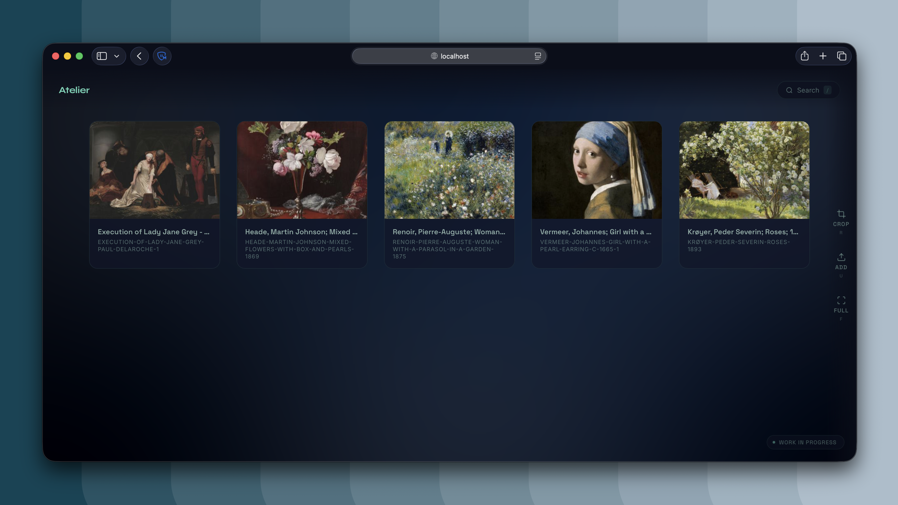

# Atelier
An art gallery for **massive** (gigapixel) works of art. Served in your browser with everything stored on disk.

## How does it look?


<p align="center">
  
</p>

*More customization is planned, when I get the time!*

## Get started
Requirements: Python 3.11+, [pyvips](https://libvips.github.io/pyvips/) (not required, but highly recommended for large images)

```bash
git clone https://github.com/DamienBlackwood/art-viewer.git
cd art-viewer
python3 serve.py
```

And then access `http://localhost:8000`. To upload an image, click the Add button or press `u`.

## Features

Check [changelog](CHANGELOG.md)!


# Rationale

It's converting images into Deep Zoom tiles and I serve them using a self madelocal viewer capable of utilising DZI.

## Under the hood (reflections)

Uses OpenSeadragon library for deep zoom functionality, a tiny python server for serving tiles, converting and annotation. Annotation is AES-GCM encrypted client side (I know, sounds excessive, but I really love encryption). Conversion process uses pyvips if present in order to perform shrink-on-load, which makes it faster on large images.

# Methodology

All code written by me, drawing from existing research but implemented independently. No AI was used.

## License

MIT